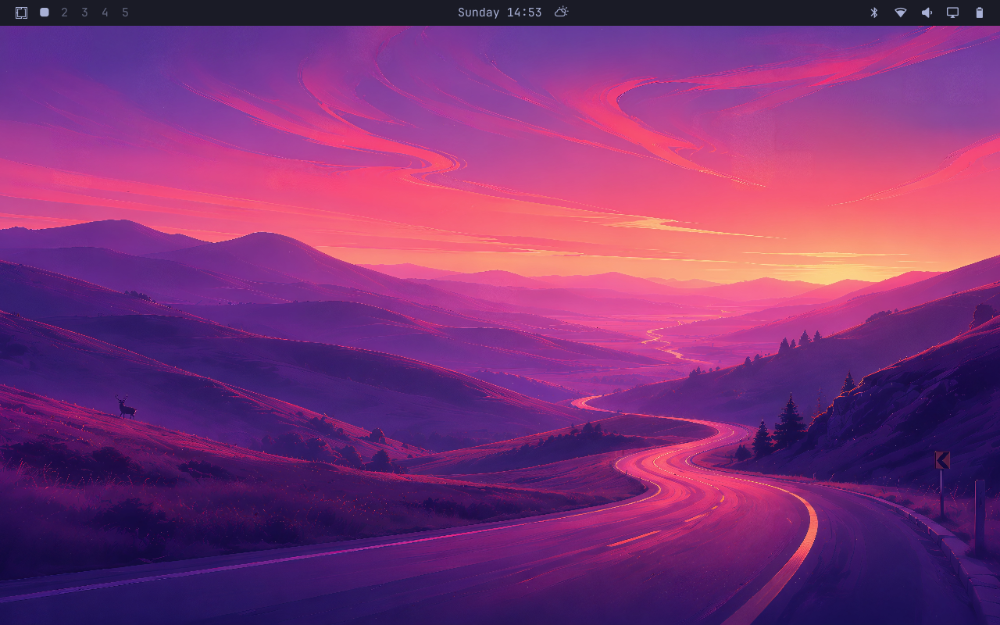
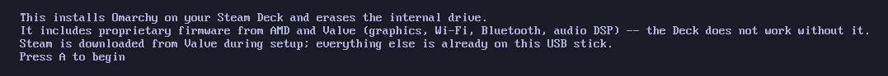
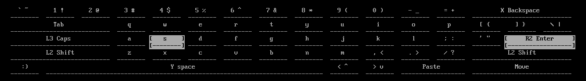
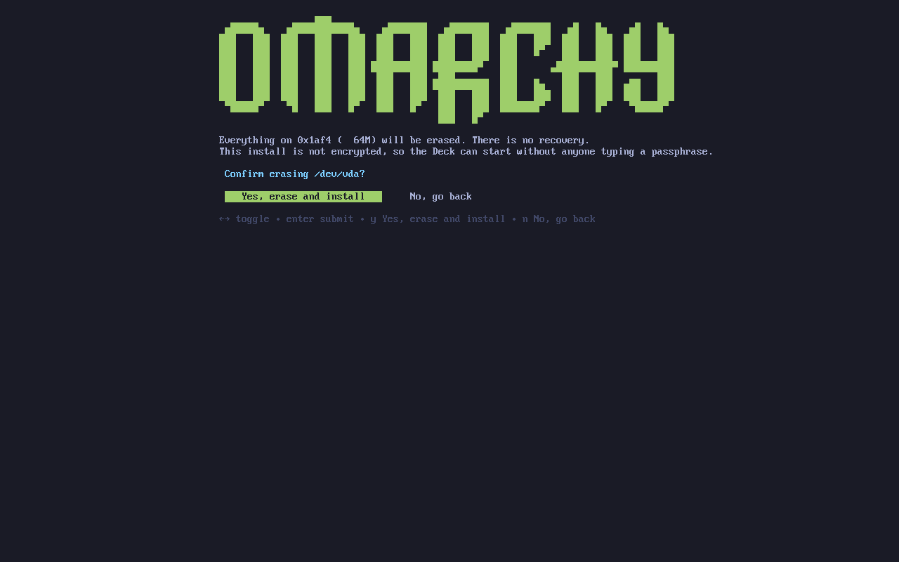

# Pizzarchy: Omarchy on your Steam Deck

**Hot and ready in about twenty minutes — one bootable USB, no keyboard, and
Gaming Mode is unchanged. Easy as Pizza(rchy) pie.**

One bootable USB installs [Omarchy](https://omarchy.org) on your Steam Deck with no keyboard/mouse required. Installation is driven entirely by the Deck's buttons and
trackpads.

Afterwards, the Deck behaves like it always did as turning your Deck on lands you in Gaming Mode and power button puts the Deck to sleep/wake. The difference is **Desktop Mode**, which now drops you into an Omarchy/Hyprland desktop. Use the QAM button and menu to go back to Gaming Mode.

> _**[ IMAGE — hero: the Deck in hand, running the Omarchy desktop ]**_
> `docs/images/hero-desktop.png`

---

## What you need

| | |
|---|---|
| **A Steam Deck OLED** | Verified on OLED. **Not tested on the LCD model.** |
| **A USB stick, 8 GB or larger** | [Ventoy](https://www.ventoy.net) is the tested path |
| **An internet connection** | **Required during install.** Steam is downloaded from Valve as part of setup, and the installer will not continue without a connection. Wi-Fi or a dock's ethernet both work. |
| **About twenty minutes** | And a Deck you are willing to erase — see below |

⚠️ **This wipes the device.** It is not dual-boot, and there is no undo inside
the installer. Back up anything you care about, including saves that are not on
Steam Cloud. Getting back to stock SteamOS means Valve's official recovery
image — see [Recovery](#recovery).

---

## What you get

**Gaming Mode.** Same gamescope session, same library, same controller behaviour.

**Desktop.** Full Omarchy: Hyprland, Waybar, the whole environment, tuned for the Deck's panel and gamepad.

**Install from the Deck.** Every screen is A / B / D-pad / trackpads, including typing your Wi-Fi password on an on-screen keyboard drawn right on the console.

**Boots straight into Gaming Mode.** Steam is installed *and updated* during setup.



> _**[ IMAGE — Steam menu showing "Switch to Desktop" ]**_ `docs/images/switch-to-desktop.png`
>
> _**[ IMAGE — Gaming Mode library, to show it is stock ]**_ `docs/images/gaming-mode.png`

---

## Install

1. **Get the image.**

   > _**[ LINK — Internet Archive download + sha256 ]**_

2. **Write it to a USB stick.** With Ventoy, copy the `.iso` onto the Ventoy partition.

3. **Boot it.** Hold **Volume Down + Power** until the boot menu appears, then pick the USB stick.

4. **Follow the screens.** Keyboard layout, Wi-Fi, your account, then the disk.

5. **Wait.** Reboots when finished, and comes up in Gaming Mode.

> Ventoy's own boot menu draws rotated 90° on the Deck's panel.



> _**[ IMAGE — Wi-Fi network list ]**_ `docs/images/install-02-wifi.png`





> _**[ IMAGE — install progress ]**_ `docs/images/install-05-progress.png`

---

## Controls

| | |
|---|---|
| **STEAM + X** | on-screen keyboard |
| **STEAM + Y** | close the focused window |
| **A** / **B** | confirm / back |
| **L2** / **R2** | left / right trackpad click |
| **STEAM** | apps menu |
| **QAM** (the ⋯ button) | the Omarchy menu |

---

## What's supported

| | |
|---|---|
| Kernel | Valve's Neptune kernel, the same one SteamOS runs |
| Boot | Limine, booting to Gaming Mode by default |
| Gaming Mode | gamescope, stock behaviour, Steam already installed and up to date |
| Desktop Mode | Omarchy / Hyprland, reachable from the Steam menu |
| Touchscreen | works in Desktop Mode |
| Suspend / wake | power button |
| Display | brightness control, correct panel rotation |
| Audio | speakers and headphones, Valve's DSP |
| Wi-Fi | in the installer and on the installed system |
| Controller | full navigation, plus an on-screen keyboard for text entry |

---

## Building it yourself

Needs Docker and ~40 minutes. The build is scripted.

```bash
git clone --recursive https://github.com/villenull/Pizzarchy
cd Pizzarchy
iso/bin/build
```

The finished `.iso` lands in the build's `release/` directory with its sha256.

Build refuses to proceed if any of its guards fail.

---

## Reporting a bug

Open an issue. The most useful thing you can attach is the install record, which already carries a per-step status:

```bash
cat /var/log/omarchy-deck-install.json
```

---

## Recovery

This install replaces SteamOS. To go back, use **Valve's official Steam Deck Recovery Image** — see [`docs/RECOVERY.md`](docs/RECOVERY.md) for the exact steps, including restoring the stock partition layout.

---

## How it works

A fork of Omarchy's own installer with a Steam Deck overlay: a controller-driven form layer over the install screens, an input mapper that turns the gamepad into keyboard events (including an on-screen keyboard drawn on the console), Valve's Neptune kernel and audio DSP, and a session layer that preserves gamescope while adding a route to the Omarchy desktop.

The ISO carries a complete package mirror — around 1,300 packages — so the system itself installs from the USB stick rather than over the network. That is why the install is quick and does not fall over on a slow connection. The internet requirement is for **Steam specifically**, which is downloaded from Valve during setup rather than redistributed here.

| Path | What lives there |
|---|---|
| `src/` | Shipped to the Deck — kernel/boot automation, session layer, input mapper |
| `iso/` | The ISO build: upstream submodule, our overlay, the build entrypoint |
| `tools/` | Dev-machine tooling, never shipped |
| `test/unit/` | Fast suites, no VM needed — run in CI on every push |
| `test/vm/` | QEMU suites: install harness, kernel/hook/idempotency, gamepad |
| `docs/` | Design docs, research findings, and the full engineering record |

`docs/PROGRESS.md` is the working notebook.

---

## Prior art

`28allday/deckshift`, `omarchy-deck-iso` and `omasteam` are the closest neighbors. Bazzite and ChimeraOS solve Deck hardware, but not Omarchy.

---

## Contributing

`docs/START-HERE.md` is the entry point, and `docs/ROADMAP.md` has the plan. If you are using Claude Code, the whole opening prompt is:

```
Read docs/START-HERE.md and begin.
```

---

## License and affiliation

**An independent project. Not affiliated with, endorsed by, or supported by Basecamp or Valve.** "Omarchy" and "Steam Deck" are used descriptively, to say what this installs and what it runs on.

MIT — see [LICENSE](LICENSE). Omarchy, SteamOS, gamescope, and Valve's kernel and firmware packages are covered by their own licenses.
